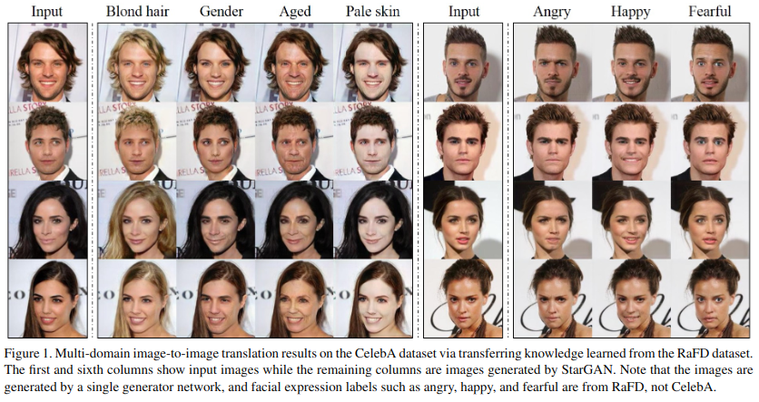

Abstract

bài báo thuộc lĩnh vực image2image

Việc translate giữa hai miền hình ảnh đã có những kết quá ấn tượng. Tuy nhiên, các phương pháp hiện tại có khả năng mở rộng và robustness hạn chế trong việc xử lý nhiều hơn hai miền, vì các mô hình khác nhau cần được xây dựng độc lập cho mỗi cặp miền hình ảnh

StarGAN có thể mở rộng, thực hiện dịch từ hình ảnh sang hình ảnh cho nhiều miền chỉ bằng một mô hình duy nhất

StarGAN cho phép huấn luyện song song nhiều dataset với các miền khác nhau trong cùng một mạng, từ đó làm tăng hiệu năng

Tác giả chứng minh tính hiệu quả của phương pháp đối với tác vụ chuyển thuộc tính khuôn mặt (facial attribute) và tổng hợp biểu hiện khuôn mặt (facial expression synthesis)

1. Introduction

tác vụ image2image translation có nhiệm vụ thay đổi một khía cạnh cụ thể của image đầu vào thành một giá trị khác (ví dụ hay đổi biểu cảm khuôn mặt)

tác vụ image2image phát triển cùng với sự phát triển của GANs (generative adversarial networks)

attribute: hair color, gender, age
attribute value: black/blond/brown; male/female

domain là tập hợp những ảnh chia sẻ cùng một attribute value (women domain vs men domain)

CelebA dataset bao gồm 40 nhãn liên quan đến facial attributes (hair color, gender, age, ..)

RaFD dataset có 8 nhãn liên quan đến facial expressions (happy, angry, sad)

multi-domain image-to-image translation: thay đổi giá trị thuộc tính sang nhiều miền

các phương pháp trước đó có nhược điểm: để học tất cả mapping giữa k domain thì cần k(k-1) generator được huấn luyện. Đổng thời không thể huấn luyện 2 dataset có thuộc tính nhãn khác nhau

ý tưởng của StarGAN là genertor lấy cả hình ảnh và thông tin miền làm đầu vào, học cách dịch hình ảnh sang miền tương ứng. Tác giả sử dụng giá trị thuộc tính này được biểu diễn qua vector nhị phân hoặc one-hot

tác giả giới thiệu một cách tiếp cận đơn giản nhưng hiệu quả cho phép đào tạo chung giữa các miền của các bộ dữ liệu khác nhau bằng cách thêm vector mặt nạ vào nhãn miền. Phương pháp đảm báo mô hình có thể bỏ qua các nhãn không xác định và tập trung vào nhãn được cung cấp. 

2. Related Work

Generative Adversarial Networks

Confitional GANs

Image-to-image Translation

3. Star Generative Adversarial Networks

genertor

discriminator

Adversarial Loss

genertor G cố gắng cực tiểu hóa hàm object trên còn disdcriminator cố gắng cực đại hóa hàm object trên

Domain Classification Loss

Reconstruction Loss

Full Objective

3.2 Training with Multiple Datasets

Mask Vector

Training Strategy

discriminator chỉ cố gắng tối thiểu hóa lỗi phân loại liên quan đến nhãn đã biết (khi huấn luyện trên ảnh của CelebA, the discriminator chỉ tối thiểu hóa lỗi của nhãn liên quan đến CelebA attributes không phải facial expressions)

4. Implementation

Improved GAN Training

Network Architecture

dựa theo CycleGAN, PatchGANs

5. Experiments

